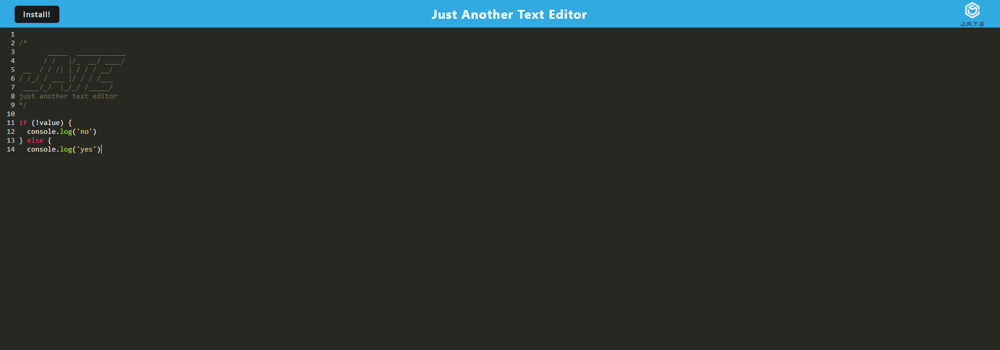

# J.A.T.E

[](https://opensource.org/licenses/MIT)

This is a Progressive Web Application (PWA) Text Editor project that allows you to create and manage notes or code snippets, with or without an internet connection. The application utilizes IndexedDB for data storage, enabling you to reliably retrieve your content for later use, even in offline mode.



## Demo

If you want to test the application, you can go to [this]() website!

## Technologies Used

- JavaScript
- IndexedDB
- Webpack
- Babel
- Workbox
- WebpackPwaManifest

## Getting Started

1. Clone the starter code repository and create your own repository with the starter code.

2. Run the following command to start the application:

   ```bash
   npm run start
   ```

## Usage

1. Open the text editor in your browser.

2. Create and edit notes or code snippets.

3. Content is automatically saved to IndexedDB when you click off the DOM window.

4. Install the application as a Progressive Web Application for offline access.


